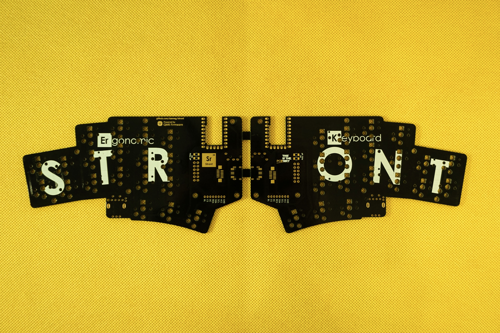
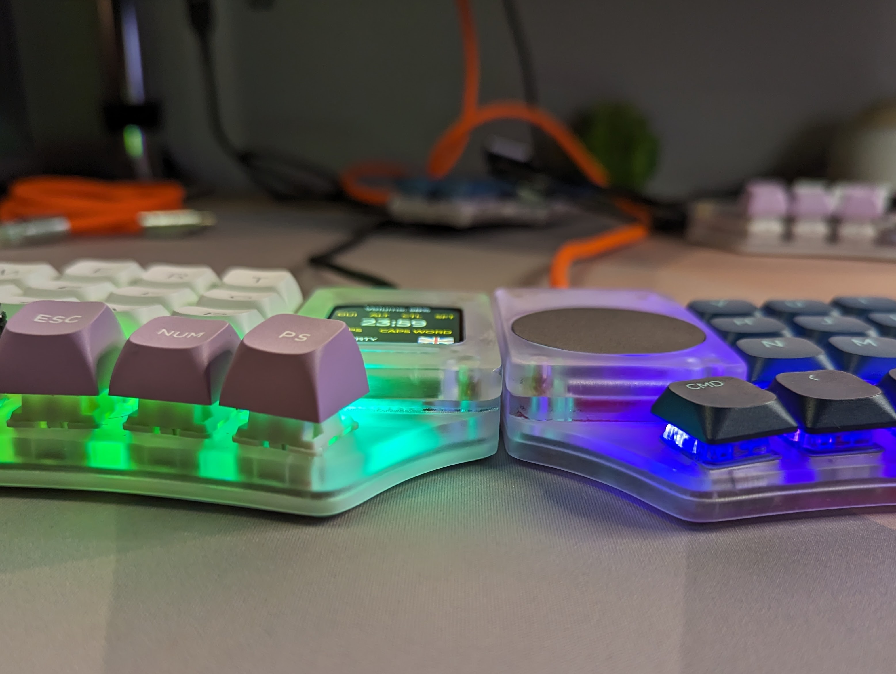

# stront

Split keyboard with 38 keys, LCD display and Cirque trackpad.

## Features

- MX, KS-33 or Choc switches
- wired split with USB-C or TRRS interconnection
- 38 keys
- roller/rotary encoders
- LCD display (1.69" 240x280 by default)
- Cirque trackpad (40mm by default)
- 2-key pinky columns
- 3D printed cases

**PCB has all SPI/I2C contacts exposed, so any other device can be used instead, it's just a matter of changing the case (at least that's the idea).**

## Photos

### Choc version

### MX Version

### Display with PC companion app

https://github.com/zzeneg/stront/assets/910255/bb812821-9b2b-454a-a9a5-45d696a1f5aa

## Firmware

[Host application](https://github.com/zzeneg/qmk-hid-host) for Raw HID communication.

QMK (work in progress)

- [source code](https://github.com/zzeneg/qmk_firmware/tree/feature/stront/keyboards/stront)
- [pre-compiled files](./firmware/qmk/):
  - `default` - sample keymap with home row mods. Not recommended for longer use - create your own.
  - `hid` - default keymap with HID support. Requires host-hid application.
  - `i2c` - default keymap with I2C Cirque instead of default SPI.
  - `zzeneg` - my highly customized layout (with HID and I2C).

## Build Guide

[MX/KS version](./build-guide/mx/readme.md)

[Choc version](./build-guide/choc/readme.md)

## Support

If you like my work and want to support my future designs, please consider [sponsorship](https://github.com/sponsors/zzeneg).

### Sponsors

Thank you very much for your support!

