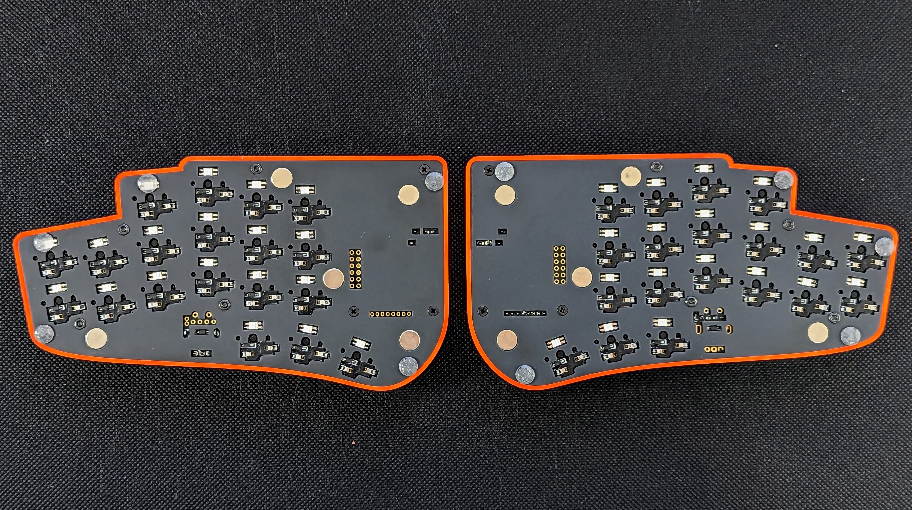
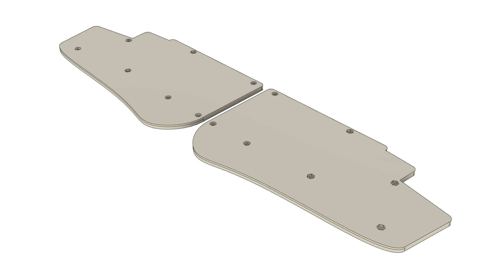

# stront

Split keyboard with 38 keys, LCD display and Cirque trackpad.

## Features

- low profile with Choc V1 switches
- wired split with USB-C or TRRS interconnection
- 38 keys
- roller/rotary encoders
- LCD display (1.69" 240x280 by default)
- Cirque trackpad (40mm by default)
- 2-key pinky columns
- splay on ring/pinky columns
- 3D printed cases

**PCB has all SPI/I2C contacts exposed, so any other device can be used instead, it's just a matter of changing the case (at least that's the idea).**

## Photos

https://github.com/zzeneg/stront/assets/910255/bb812821-9b2b-454a-a9a5-45d696a1f5aa

## Gerber files

- [PCB](./gerbers/choc/pcb.zip)

## Case files (3d printed)

All files are in [stl](stl) folder.

- thin version - just cutouts for all elements, as low as it can be. May be combined with normal top case and metal bottom plate for additional weight. Has additional holes for 8mm magnets.
  
- normal (1mm higher)
  

## Ordering

PCB was created in collaboration with [PCBWay](https://www.pcbway.com), so I've added their logo on the PCB. Feel free to remove it and/or use any other manufacturer, however I had very positive experience with PCBWay and their FR4 and silkscreen are high quality so I can definitely recommend them. And as EU customer I particularly liked their fast shipping options and ability to pay all taxes at once.

If you'd like to support me financially please consider ordering using my [shared project](https://www.pcbway.com/project/shareproject/Stront_low_profile_keyboard_85ec2664.html) or use [referral link](https://pcbway.com/g/3wpLAF) for signing up.

3D printed case can be printed at home or ordered from a manufacturer, I tested it with black/white resin.

## Firmware

[Host application](https://github.com/zzeneg/qmk-hid-host) for Raw HID communication

QMK (work in progress)

- [source code](https://github.com/zzeneg/qmk_firmware/tree/feature/stront/keyboards/stront)
- [pre-compiled files](./firmware/qmk/):
  - `default` - sample keymap with home row mods. Not recommended for longer use - create your own.
  - `hid` - default keymap with HID support. Requires host-hid application.
  - `i2c` - default keymap with I2C Cirque instead of default SPI.
  - `zzeneg` - my highly customized layout (with HID and I2C).

## [BOM, Build Guide](./build-guide/build-guide.md)

## Support
If you like my work and want to support my future designs, please consider [sponsorship](https://github.com/sponsors/zzeneg).
