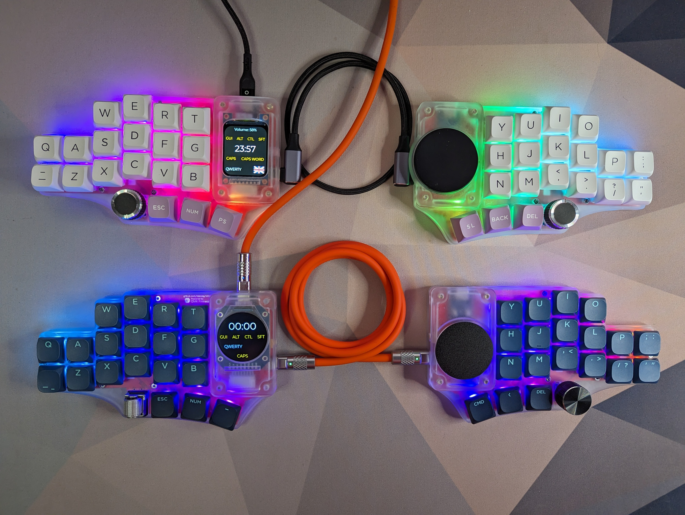
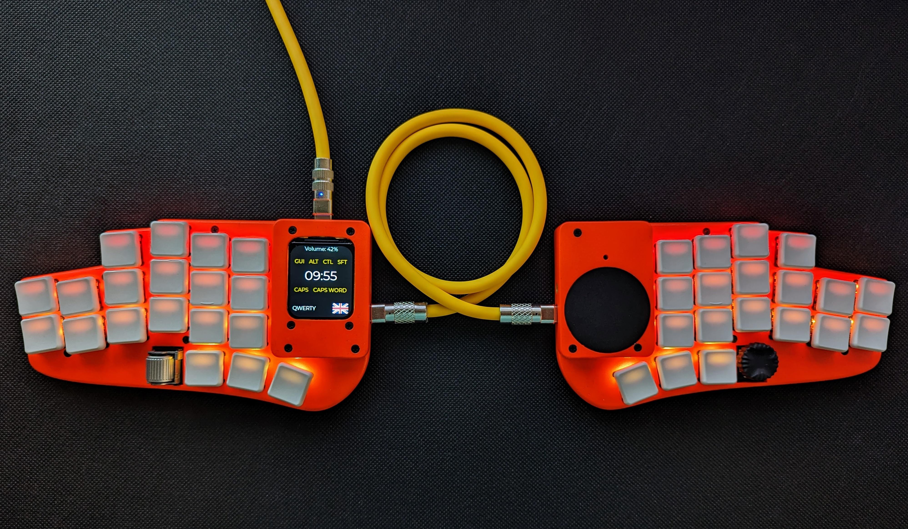

# stront

Family of modular split keyboards with 38 or 40 keys, LCD display and Cirque/Azoteq trackpad.

## Features

All versions:

- LCD display (1.69" 240x280 by default)
- Cirque or Azoteq (with VIK adapter) trackpad
- roller/rotary encoders
- 3D printed cases
- exposed SPI/I2C contacts, so any other device can be used instead, it's just a matter of changing the case

|                                                    | MX-40              | MX-38              | Choc               |
| -------------------------------------------------- | ------------------ | ------------------ | ------------------ |
| Number of keys                                     | 40                 | 38                 | 38                 |
| Supported switches                                 | MX/KS              | MX/KS              | Choc               |
| Interconnect                                       | USB-C              | USB-C/TRRS         | USB-C/TRRS         |
| Interconnect                                       | USB-C              | USB-C/TRRS         | USB-C/TRRS         |
| [VIK](https://github.com/sadekbaroudi/vik) support | :heavy_check_mark: | :heavy_check_mark: | :x:                |
| Module system                                      | :heavy_check_mark: | :heavy_check_mark: | :x:                |
| Splay                                              | :x:                | :x:                | :heavy_check_mark: |

## Photos

#### MX-38 Versions (MX and KS-33)

#### Choc version

#### Display with PC companion app

https://github.com/zzeneg/stront/assets/910255/bb812821-9b2b-454a-a9a5-45d696a1f5aa

## Available modules - MX38/MX40 versions only ⚠️

- LCD displays
  - ST7789 1.69" 240x280
  - ST7789 2" 240x320
  - GC9A01 round 1.28" 240x240
- Touchpads
  - Cirque 40mm flat
  - Cirque 40mm curved
  - Azoteq TPS43
  - Azoteq TPS65

## Firmware

[Companion app](https://github.com/zzeneg/qmk-hid-host) for Raw HID communication.

#### QMK

Please see main `config.h` and `rules.mk` for comments and available options.

- [source code](https://github.com/zzeneg/qmk_firmware/tree/feature/stront/keyboards/stront)
- [pre-compiled files](./firmware/qmk/)

#### Vial

- [source code](https://github.com/zzeneg/vial-qmk/tree/feature/stront)
- [pre-compiled files](./firmware/vial/)

#### Compiled versions

- keymaps:
  - `default` - sample keymap with home row mods. Not recommended for longer use - create your own.
  - `hid` - default keymap with HID support. Requires companion application.
  - `zzeneg` - my highly customized layout.
- hardware versions:
  - `-rect-` - rectangular display (ST7789 240x280)
  - `-round-` - round display (GC9A01 240x240)
  - `-flat-` - flat 40mm Cirque
  - `-curved-` - curved 40mm Cirque
  - `-azoteq-` - Azoteq TPS43

> Each firmware name has two modules, first is on the left side, second on the right, e.g. if your keyboard has Azoteq on the left and round display on the right - choose `azoteq-round`

## Build Guide

[MX38/MX40 versions](./build-guide/mx/readme.md)

[Choc version](./build-guide/choc/readme.md)

## VIK - MX38/MX40 versions only ⚠️

> VIK is a standard for a data interface between printed circuit boards. It is intended to provide modularity between a mechanical keyboard PCB and additional features.

[VIK repository](https://github.com/sadekbaroudi/vik)

#### Certification card

| Category               | Classification       | Response                          |
| ---------------------- | -------------------- | --------------------------------- |
| FPC connector          | Required             | :heavy_check_mark:                |
| Breakout pins          | Recommended          | :heavy_check_mark:                |
| Supplies: SPI          | Strongly recommended | :heavy_check_mark: [1] |
| Supplies: I2C          | Strongly recommended | :heavy_check_mark: [1] |
| I2C on main PCB        | Discouraged          | No                                |
| I2C pull ups           | Informative          | Optional[2]            |
| Supplies: RGB          | Strongly recommended | :heavy_check_mark:                |
| Supplies: Extra GPIO 1 | Required             | Digital                           |
| Supplies: Extra GPIO 2 | Required             | Digital                           |

**[1]**: I2C and SPI use same pins, so you can use only one or the other, not both. Selection is configured in firmware.

**[2]**: PCB has pads designed for 1206/3216 SMD resistors, you can solder them manually if needed.

#### VIK usage

Built-in display and trackpad use the same interface, so any additional VIK module will have to replace one of them (it's possible to combine other I2C modules with Azoteq). Depending on the size it can integrated into the cover or a standalone case.

All possible connectors support VIK - FPC horizontal on the back, FPC vertical on the front and the breakout pins.

## Support

If you like my work and want to support my future designs, please consider [sponsorship](https://github.com/sponsors/zzeneg), ordering from PCBWay using my shared projects - [Choc](https://www.pcbway.com/project/shareproject/Stront_low_profile_keyboard_85ec2664.html) or [MX38](https://www.pcbway.com/project/shareproject/Stront_MX_KS_33_keyboard_6a70e49a.html), or using [referral link](https://pcbway.com/g/3wpLAF) for signing up.

#### Sponsors

Thank you very much for your support!

