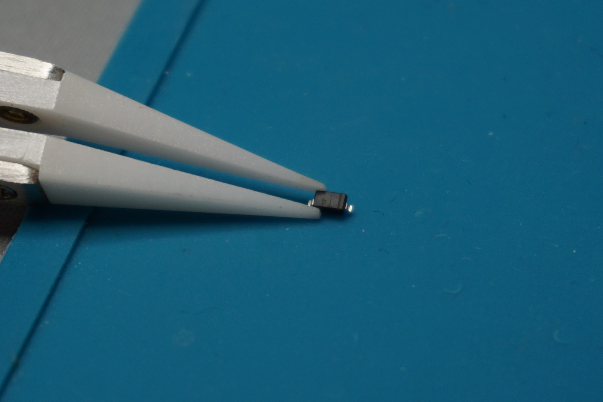
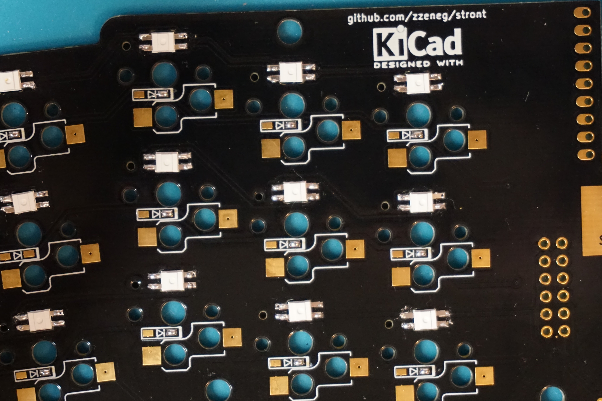
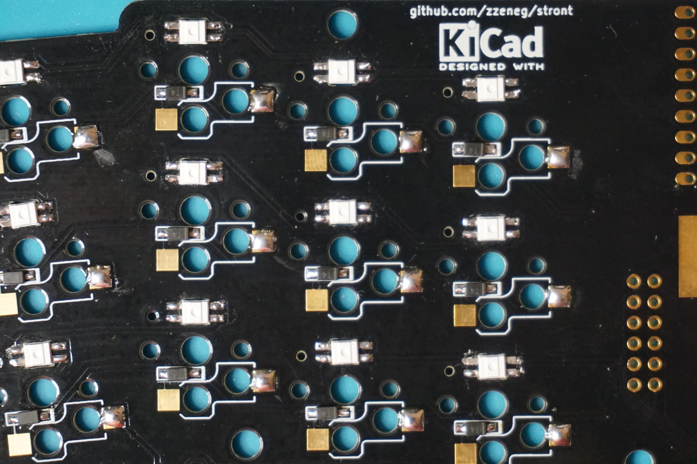
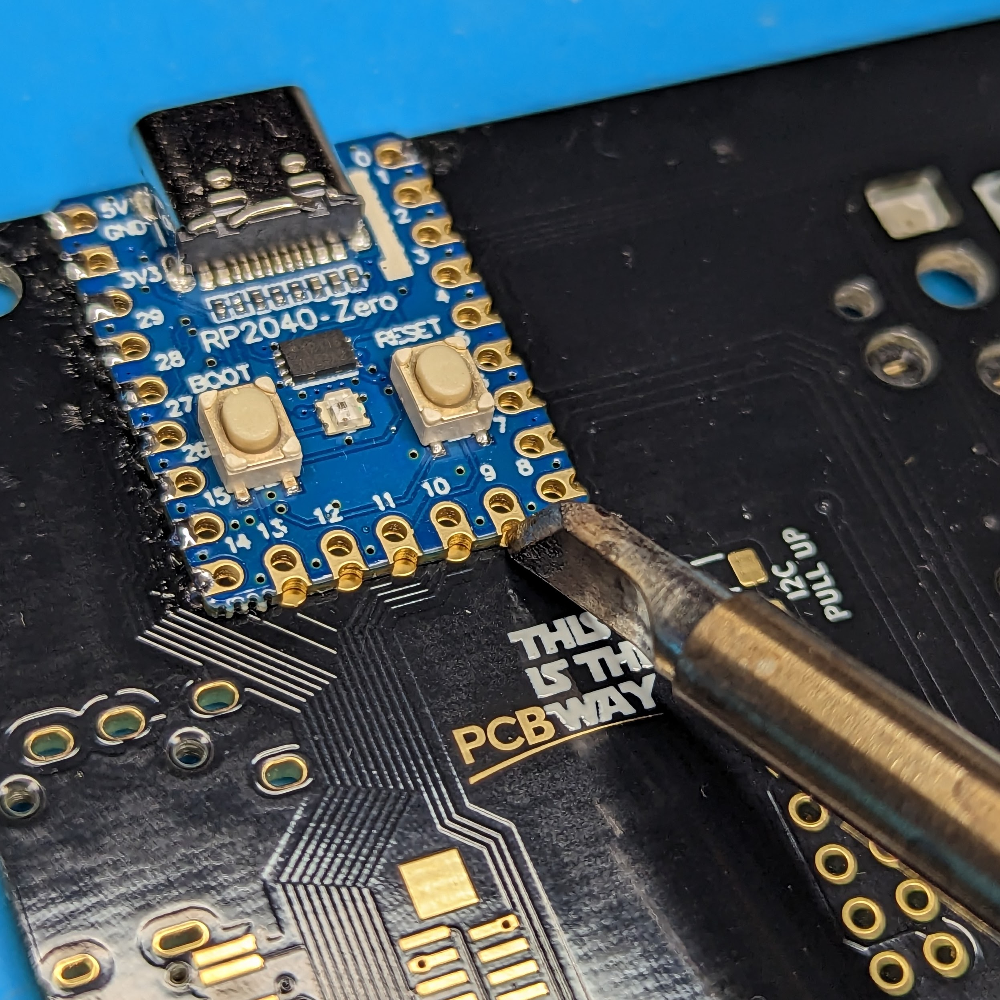
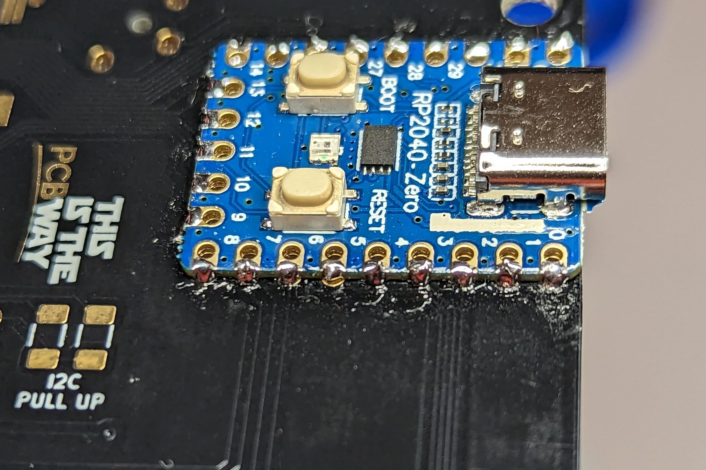
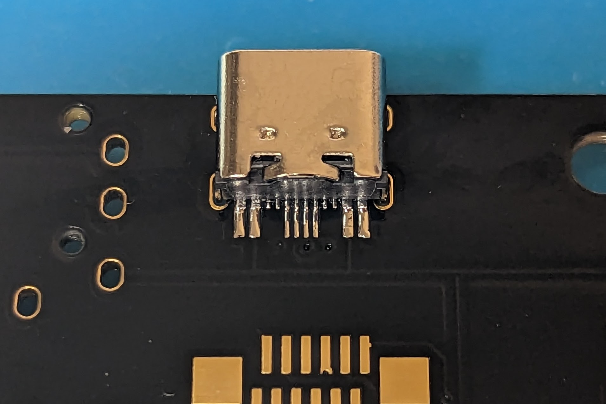
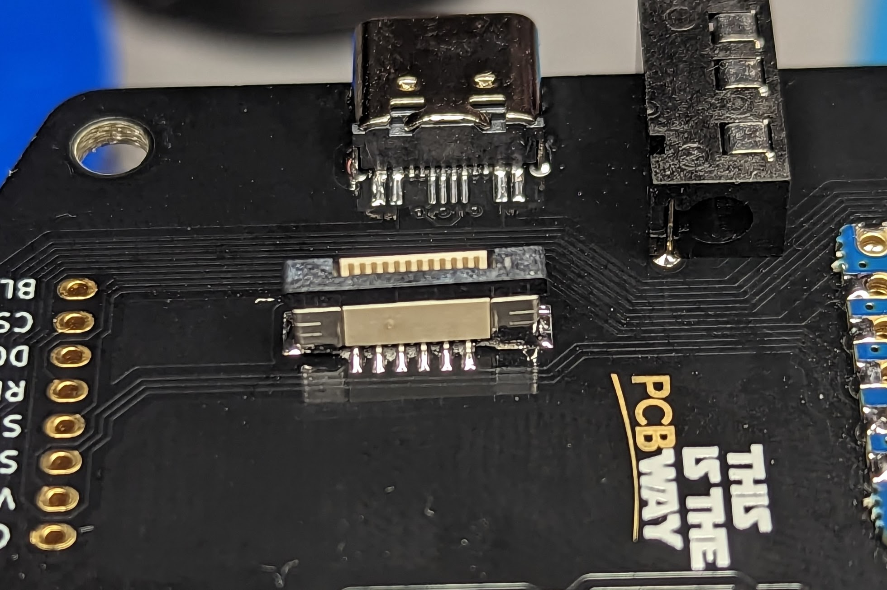
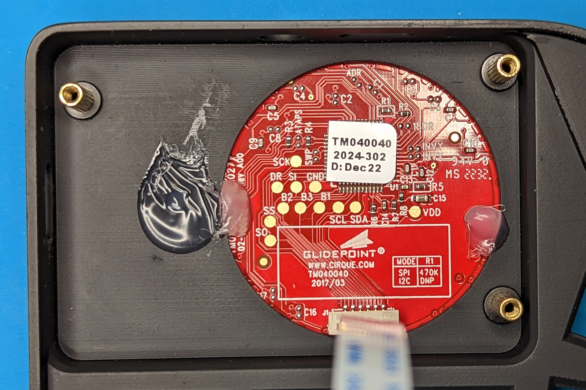
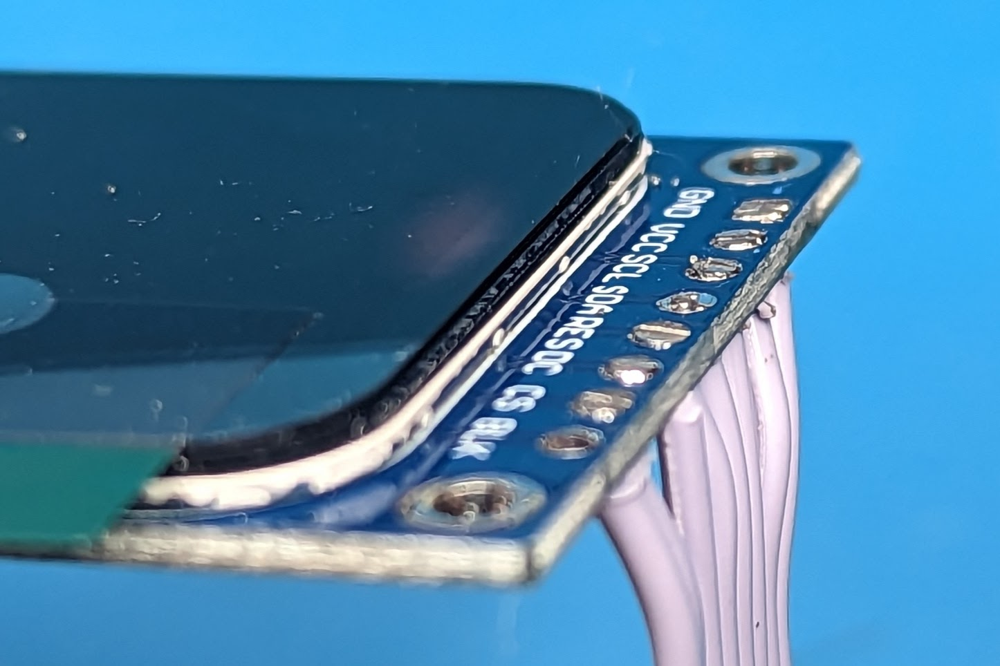
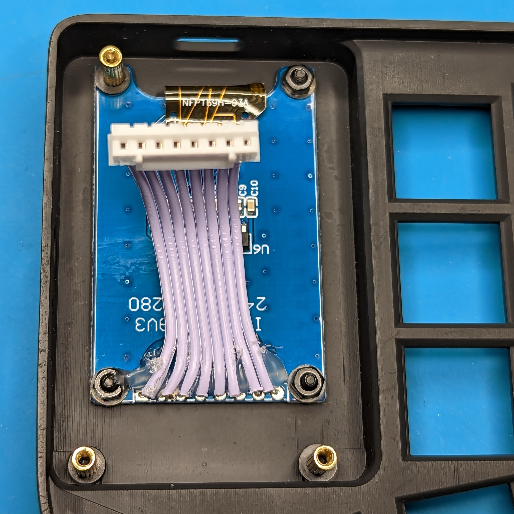

# Build Guide

## Gerber files

- [PCB](/gerbers/choc.zip)

## Case files (3d printed)

All files are in [case/choc](/case/choc) folder.

- thin version - just cutouts for all elements, as low as it can be. May be combined with normal top case and metal bottom plate for additional weight. Has additional holes for 8mm magnets.
  
- normal (1mm higher)
  

## Ordering

PCB was created in collaboration with [PCBWay](https://www.pcbway.com), so I've added their logo on the PCB. Feel free to remove it and/or use any other manufacturer, however I had very positive experience with PCBWay and their FR4 and silkscreen are high quality so I can definitely recommend them. And as EU customer I particularly liked their fast shipping options and ability to pay all taxes at once.

If you'd like to support me financially please consider ordering using my [shared project](https://www.pcbway.com/project/shareproject/Stront_low_profile_keyboard_85ec2664.html) or use [referral link](https://pcbway.com/g/3wpLAF) for signing up.

3D printed case can be printed at home or ordered from a manufacturer, I tested it with black/white resin.

## Materials

- PCBs
- Case (4 parts)
- 2 Waveshare [RP2040 Zero](https://www.aliexpress.com/item/3256804090654134.html) MCUs
- 38 [SMD SOD-123 1N4148](https://www.aliexpress.com/item/1005002882901030.html) diodes
- 2 [EC11/12 rotary encoder](https://www.aliexpress.com/item/33006686909.html) with [knob](https://www.aliexpress.com/item/1005003425428192.html) or [Panasonic EVQWGD001 roller encoder](https://www.aliexpress.com/item/32990950196.html)
- 8mm M2 female-female [standoffs](https://www.aliexpress.com/item/4001271908929.html)
- 5mm (and 6mm if normal case) M2 [screws with flat head](https://www.aliexpress.com/item/4001248931159.html)
- M2 [nuts](https://www.aliexpress.com/item/1005001412230125.html)
- [LCD 1.69" 240x280 display](https://www.aliexpress.com/item/1005004922900927.html)
- Right angled PH2.0 8pin [male connector](https://www.aliexpress.com/item/1005003115054198.html)
- PH2.0 8 pin [female connector with wires](https://www.aliexpress.com/item/4000130210271.html)
- 40mm flat Cirque trackpad (I2C or SPI)
- Vertical 12pin FFC/FPC [connector](https://www.aliexpress.com/item/10000000737049.html)
- 12pin 0.5mm pitch 10cm [FFC cable](https://www.aliexpress.com/item/1005002468369055.html) - grab both reverse and forward variants, in case you solder the connector upside down
- TRRS [connectors](https://www.aliexpress.com/item/4000661212458.html) and [cable](https://www.aliexpress.com/item/1005003676559658.html)
- USB-C [16pin connectors](https://www.aliexpress.com/item/1005003670899595.html) and [cable](https://www.aliexpress.com/item/1005004649061153.html) - optional
- [RGB LEDs 3mA](https://www.aliexpress.com/item/1005003636607308.html)
- Rubber [sheet](https://www.aliexpress.com/item/1005003938672544.html) or [7x1.5 legs](https://www.aliexpress.com/item/1005002995402961.html)
- 8mm magnets (if needed) - 2mm for rubber sheet version, 3mm for regular legs

## Tools

- Soldering iron. Any iron will work, but I highly recommend something small like TS100 or Pinecil with TS-K tip, it's good for SMD soldering
- Solder, preferably with lead if you can get one. For EU I recommend this [shop](https://botland.store) and Cynel brand. 0.56mm is great for SMD, and you can optionally get 0.9mm for hotswap sockets
- [Soldering paste](https://www.aliexpress.com/item/4000602425410.html)
- [Flux](https://www.aliexpress.com/item/1005004441105643.html)
- Tweezers (I prefer [reverse](https://www.aliexpress.com/item/1005004188266714.html) instead of regular), pliers, soldering mat, isopropyl alcohol (IPA) and [cotton pads](https://www.aliexpress.com/item/1005003798227116.html) for cleaning

## Build

Start with breaking the combined PCB into two halves using pliers. You can sand down the breaking points or just polish with a sharp knife. Just a bit, small pieces of PCB material are pretty bad for breathing in. Choose left or right half and place it upside down, we'll start from bottom side.

### LEDs

First of all, LEDs can be destroyed with heat, so be careful - use lower temp (something like 300C or lower depending on your solder) and don't hold the iron longer that needed. Second, be careful with placing the LED, they are not symmetrical. One pin (ground) is chamfered, it must be placed on a pad with similar shape (left bottom if you look on it).

There are several ways of soldering them, my favorite is:

- pre-tin all 4 pads 
- put a LED into place and press it gently with your fingernail or tweezers
- use TS-K tip to heat two pads and pins at the same time 
- do the same for other two pins
- repeat it for all LEDs

If you don't have a TS-K tip, just do all the pins one by one. The most important thing is to heat pin and pad simultaneously, otherwise you may have cold joints. You can experiment with solder paster and/or flux but I felt like it takes more time without any benefits.

### Diodes

Again, orientation is important. Every diode has a vertical line on it marking the side with cathode, experiment with lighting and angle if you don't see it.

On the PCB cathode is marked with a thick outside line and a vertical line between pads. Here on the photo cathode pad is tinned.

Soldering order:

- tin one pad (doesn't really matter which one, what's important is consistency)
- grab a diode with tweezers and make sure it's oriented correctly
- place it next to the tinned pad, heat the solder blob, put the diode to its place and press it down with fingernail
- solder the second pin by simultaneously heating the pad, pin and solder wire

Repeat it for all diodes, then clean everything with IPA.

### Hotswap sockets

These are also asymmetrical but orientation does not really matter. You can still orient all of them in same way, border lines on PCB should help with that. If you have thick solder wire - use it, you'd need much more solder here compared to LEDs/diodes. Soldering process is the same as for diodes - pre-tin one side, put the socket, heat solder and push it into place. Solder second pin, repeat for all others.

Clean it with IPA, it's a bit harder with sockets but do your best.

### MCU

We're done with bottom side, so **FLIP THE PCB**. MCU goes on top side, so triple check it, you really-really don't want to solder it on the bottom side (I did it once so I know what I'm talking about). Also, I recommend to flash the MCU before soldering, I didn't see a dead one yet but you never know. Connect it to the computer and put a [precompiled firmware file](./../firmware/qmk/stront_default.uf2) into a disk that would appear.

I like to solder only castellated holes (edges) on MCU by holding my tip like this:

Soldering process:

- pre-tin one (any) pad
- place the MCU on pads, heat the pre-tinned pad and move MCU into correct place (all holes must match), you can use pinhead/socket row to align it
- solder a pad on the opposite side of the MCU to hold it in place
- go through all pads one by one and solder them
- double check everything, it may be tricky to solder the PCB's pads sometimes but it's easy to spot it (see pad 5)
  

### USB-C connector

It's a tricky one, solder paste and flux will simplify the process a lot but it's possible to do it without them.

- put the solder paste on the pads, it's better to add less than too much
  
- insert the connector into holes and solder one leg from the bottom side (just to hold it in place)
- carefully heat the pads and solder paste. Move tip from the connector to outside and remove extra solder
- if some pins are shorted - add flux (not paste!) and continue removing extra solder, be patient with it
- if pins are still shorted - desolder it completely and restart the process with a new connector
  
- when pads are done, solder other legs from bottom side, add more solder to make sure it's firmly soldered but remove extras afterwards (solder must be flat with PCB, no blobs)
- I recommend to solder legs on top side as well but not sure it's possible without TS-K or any other sharp tip
  

**DO NOT CONNECT THAT USB-C TO YOUR PC, IT'S ONLY FOR INTERCONNECT BETWEEN LEFT AND RIGHT SIDES**

### TRRS connector

Even if you'd like to use USB-C exclusively I still recommend to add TRRS just in case. It's super easy (I didn't even take a photo of it, sorry).

### Second half - repeat all previous steps

### Cirque touchpad

Pretty similar to USB-C connector but easier thanks to 1mm space between pins. Also if you fail the step you can use a [daughterboard](https://www.aliexpress.com/item/4001156449357.html)(0.5mm pitch, 12 pins), it matches the holes on the PCB.

- take **right** PCB
- put paste on pads, make sure to leave empty space in the middle
  
- place connector with black moving part facing the switches (if you messed up here, don't worry and just use another cable during assembly)
- start soldering with small pads on one side by carefully moving the tip from connector to outside and removing extra solder
- when connector is placed correctly go the second side
- make sure there are no shorts and then solder two big pads
- you can desolder and restart in case of shorts or bad placement
  

Insert Cirque touchpad into the case, add hotglue it from bottom. There is only one position possible so you can't do it wrong (I hope). Ignore standoffs from the photo for now.

### Display

Start with adding male connector to **left** PCB (forgot to take an actual photo so that's a staged one without other components that should be already soldered for you)

Take a female connector with wires and cut them to 5cm. Make sure the connector is correctly oriented (when inserted into PCB the display should be facing up) and solder them. Cut wires/solder blobs on top afterwards so that display's PCB is flat. You can hotglue wires to display to secure them in place.

### Testing/flashing

At this point you can connect everything and test the keyboard. Again, be extra careful with USB-C ports.

- grab default [pre-compiled firmware](./../firmware/qmk/stront_default.uf2)
- connect one side to PC and go into bootloader by double pressing reset button
- copy the file onto the disk that would appear
- repeat for second half
- firmware has [EE_HANDS](https://docs.qmk.fm/#/feature_split_keyboard?id=handedness-by-eeprom) enabled so any side can be master. You'd have to specify left or right side by pressing key combinations - hold inner thumb key, then hold outer thumb key to activate SYSTEM layer. Now press outer bottom pinky key for left side or inner bottom index key for right side (insert switches into those places). E.g.

  - if your left side is detected as right side, do this:

  

  - if your right side is detected as left side, do this:

  

  See [keymap](https://github.com/zzeneg/qmk_firmware/blob/feature/stront/keyboards/stront/keymaps/default/keymap.c) for better understanding. **Reconnect the keyboard to apply changes.**

- test display and touchpad
- test all keys - insert swithes or short sockets with something like metal tweezers or TRRS cable
- test encoders
- test USB-C interconnect in all 4 possible cable positions
- test LEDs - press or lightly tap each LED with your fingers to make sure the soldering is fine, there should be no flickering
- in case of any issues go to troubleshooting section

### Assembly

- use three 5mm screws and nuts to attach the display to the case
- add three 5mm screws and 8mm standoffs (I had only 7mm ones so I added 1mm washers on the photo, ignore them)
  
- connect display, use tweezers/pliers if needed
- connect touchpad to PCB using reverse cable. If you soldered the FPC connector in the wrong way - use forward cable instead
  
- carefully insert PCB into case. Inserting USB-C/TRRS connectors will require just a bit of force
- attach bottom case, add 3 screws from bottom side (near display/touchpad)
- insert 4 nuts into bottom part, add 5mm (or 6mm for high case version) screws from top side
  
- add magnets/rubber sheet/legs if you wish

### Troubleshooting

#### Slave side does not work at all

- try to connect it directly to PC
- check that you configured right/left side during/after flashing ([EE_HANDS](https://docs.qmk.fm/#/feature_split_keyboard?id=handedness-by-eeprom))
- if you use USB-C try TRRS instead
- try another interconnect cable
- check soldering for USB-C and TRRS connectors

#### Whole row/column does not work

- check soldering on controller pins, use schematic to trace problematic row/column to an exact pin

#### Single key does not work

- check that hotswap socket and diode are soldered correctly
- short hotswap socket manually, if it works - move the hotswap springs closer to each other

#### Multiple LEDs do not work

- LEDs are wired sequentially so check the last working one and first non-working, see schematic for correct order (it's not obvious)
- press or lightly tap LEDs with fingers/tweezers to check for bad soldering
- reflow solder on LED pins
- usually a dead LEDs if the least possible scenario, so make sure to check for everything else before desoldering

#### Display does not work

- check that you configured right/left side during/after flashing ([EE_HANDS](https://docs.qmk.fm/#/feature_split_keyboard?id=handedness-by-eeprom))
- check soldering on display/connector

#### Touchpad does not work

- check that you configured right/left side during/after flashing ([EE_HANDS](https://docs.qmk.fm/#/feature_split_keyboard?id=handedness-by-eeprom))
- check soldering on connector
- check that FPC cable is a correct one (forward/reverse) and is correctly inserted (use my photo as a reference)
- check for continuity using pads on Cirque trackpad, use schematic to trace correct pins on MCU
